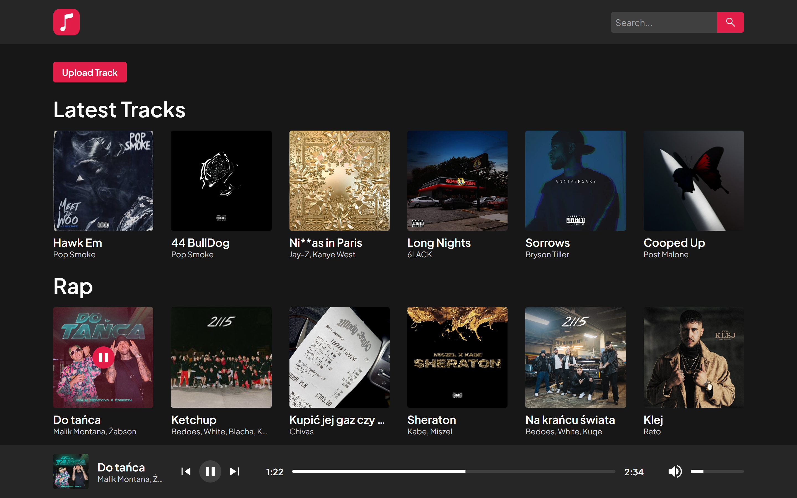

# Audio Player

### Audio Player is a website that gives you access to songs from other users around the world.

### https://audio-player.aruzo.it



## Features
- Tracks adding/editing/deleting form
- Play next/prev track
- Tracks searching bar
- Tracks are organized by genres
- Set track volume
- Mute/Unmute track

## Build With

- Next.js
- Nest.js
- Styled Components
- PostgreSQL
- Docker
- Nginx

## Installation and Usage
`You must have Docker Desktop installed`

### Clone this repository

```bash
git clone https://github.com/aruzo1/audio-player.git
cd audio-player
```

### Development

```bash
docker-compose up
```

### Production

```bash
docker-compose -f docker-compose.prod.yml up
```
